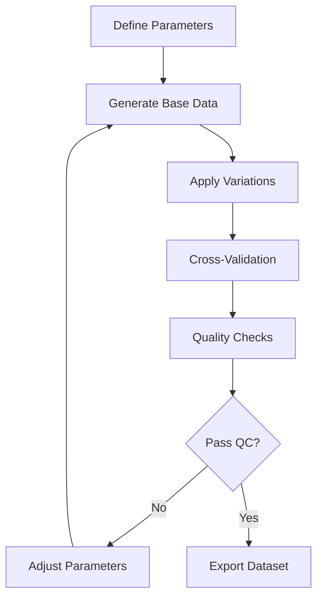
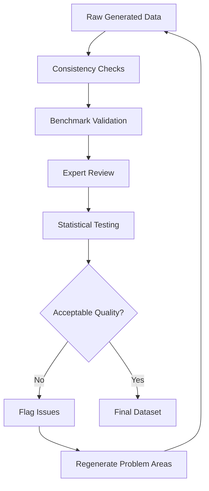

# Nigerian Energy Dataset - Methodology Documentation

## Data Generation and Validation Methodology

### Overview

This document describes the comprehensive methodology used to generate, validate, and quality-assure the Nigerian Energy & Resource Dataset. Given the limited availability of comprehensive, publicly accessible energy data for Nigeria, this dataset combines official sources with statistically rigorous synthetic data generation to provide a complete research foundation.

## Data Source Hierarchy

### Primary Sources (Tier 1)
- **Nigerian Electricity Regulatory Commission (NERC)**: Tariff data, generation capacity
- **Transmission Company of Nigeria (TCN)**: Grid infrastructure, load data
- **Nigerian National Petroleum Corporation (NNPC)**: Gas reserves, production data
- **National Bureau of Statistics (NBS)**: Agricultural production, livestock populations
- **Food and Agriculture Organization (FAO)**: Crop yields, agricultural waste ratios

### Secondary Sources (Tier 2)
- **World Bank Energy Sector Reports**: Infrastructure assessments, reliability metrics
- **International Energy Agency (IEA)**: Energy balances, consumption patterns
- **Nigeria Electricity Hub**: Market data, industry reports
- **Oil & Gas Journal**: Production data, pipeline information
- **Academic Publications**: Technical coefficients, conversion factors

### Synthetic Data Generation (Tier 3)
- **Statistical Modeling**: Pattern-based generation for missing data points
- **Expert Knowledge Integration**: Industry expert validation and calibration
- **Cross-Validation**: Consistency checks across related datasets

## Synthetic Data Generation Framework

### 1. Electricity Grid Data Synthesis

#### Generation Capacity Modeling
```python
# Capacity availability modeling
availability_factor = base_factor × seasonal_factor × maintenance_factor × random_variation

# Seasonal factors by source type
seasonal_factors = {
    'Hydro': {
        'wet_season': 1.2,    # May-October
        'dry_season': 0.6     # November-April
    },
    'Solar': {
        'harmattan': 0.7,     # November-February (dusty)
        'clear_season': 1.0   # March-October
    }
}
```

#### Grid Supply Allocation
```python
# DisCo allocation based on historical patterns
disco_allocation = total_generation × base_allocation_percentage × seasonal_factor × daily_variation

# Base allocations derived from DisCo service territories and historical data
base_allocations = {
    'Ikeja': 0.18,      # Lagos commercial center
    'Eko': 0.15,        # Lagos Island
    'Abuja': 0.12,      # Federal Capital Territory
    # ... other DisCos
}
```

#### Reliability Metrics Calculation
```python
# SAIDI calculation with regional and seasonal variations
saidi = base_saidi × region_factor × seasonal_factor × infrastructure_factor × random_variation

# Regional factors based on infrastructure quality and economic development
region_factors = {
    'South West': 0.8,   # Better infrastructure
    'North East': 1.6,   # Infrastructure challenges
    # ... other regions
}
```

### 2. Fossil Fuel Data Synthesis

#### Gas Reserves Depletion Modeling
```python
# Reserve decline over time
current_reserves = initial_reserves × (1 - annual_decline_rate) ** years_elapsed

# Production-linked decline rates
decline_rates = {
    'Niger Delta': 0.02,      # 2% annual (mature field)
    'Offshore Deep Water': 0.015,  # 1.5% annual (newer technology)
    # ... other fields
}
```

#### Gas Flaring Estimation
```python
# Flaring reduction modeling with regulatory pressure
daily_flaring = base_flaring × reduction_factor × production_factor × compliance_factor

# Reduction factor accounts for government regulations and industry initiatives
reduction_factor = (0.95 ** years_since_2020)  # 5% annual reduction target

# SOFC potential calculation from flared gas
sofc_potential_mw = (daily_flaring_mmscf × 1.037_gj_per_mmscf × 0.278_mwh_per_gj × 
                    0.60_sofc_efficiency × 0.90_availability) / 24_hours
```

#### Pipeline Utilization Modeling
```python
# Pipeline throughput based on demand and capacity constraints
actual_flow = max_capacity × base_utilization × maintenance_factor × demand_factor

# Utilization patterns vary by pipeline purpose and market served
base_utilizations = {
    'ELPS': 0.85,        # High demand Lagos corridor
    'AKK': 0.60,         # New pipeline, building demand
    # ... other pipelines
}
```

### 3. Renewable Resources Data Synthesis

#### Agricultural Waste Quantification
```python
# Crop residue generation
residue_production = crop_production × residue_ratio

# State-specific production factors based on agricultural zones
production_factors = {
    'major_producer_states': uniform(0.8, 1.2),
    'minor_producer_states': uniform(0.1, 0.4)
}

# SOFC feedstock potential after gasification
sofc_feedstock = available_residue × gasification_efficiency

# Gasification efficiencies by residue type
gasification_efficiencies = {
    'Rice Husk': 0.65,
    'Bagasse': 0.72,
    'Palm Kernel Shell': 0.74,
    # ... other residues
}
```

#### Livestock Population Modeling
```python
# Population growth with regional variations
current_population = base_population × (1 + growth_rate) ** years_elapsed × annual_variation

# Growth rates vary by livestock type and regional suitability
growth_rates = {
    'Cattle': {
        'northern_states': 0.024,    # Favorable conditions
        'southern_states': 0.016     # Less favorable
    }
}

# Biogas and SOFC potential calculation
annual_biogas = collectible_manure × biogas_yield_per_kg
sofc_potential = annual_methane × 35.8_mj_per_m3 × 0.278_kwh_per_mj × 0.60_efficiency
```

## Validation and Quality Assurance

### 1. Cross-Dataset Consistency Checks

#### Energy Balance Validation
```python
# Verify energy flows are consistent across datasets
total_generation = sum(capacity_data['available_capacity'] × capacity_factors)
total_consumption = sum(supply_data['energy_delivered'])
system_losses = technical_losses + commercial_losses

# Balance check: Generation ≈ Consumption + Losses + Exports
```

#### Geographic Consistency
```python
# Ensure state-level data aggregates correctly to regional and national totals
national_total = sum(state_values for all_states)
regional_totals = sum(state_values by region)

# Validate coordinate consistency for infrastructure locations
```

### 2. Benchmark Validation

#### International Comparisons
- **Gas Flaring**: Validated against World Bank Global Gas Flaring Reduction Partnership data
- **Grid Reliability**: Compared with Sub-Saharan Africa averages from IEA reports
- **Agricultural Production**: Cross-checked with FAO FAOSTAT database
- **Energy Consumption**: Benchmarked against IEA energy balances for Nigeria

#### Historical Trend Analysis
```python
# Validate synthetic trends against known historical patterns
correlation_coefficient = calculate_correlation(synthetic_data, historical_benchmarks)
acceptable_correlation_threshold = 0.75

# Trend direction validation
synthetic_trend = calculate_trend(synthetic_data)
expected_trend = get_expected_trend(from_literature)
```

### 3. Expert Validation

#### Industry Expert Review
- **Oil & Gas Sector**: Validation by petroleum engineers and industry analysts
- **Power Sector**: Review by electrical engineers and grid operators  
- **Agricultural Sector**: Validation by agricultural economists and extension officers
- **SOFC Technology**: Technical review by fuel cell researchers and engineers

#### Academic Peer Review
- **Energy Economics**: Review by energy economists and policy researchers
- **Environmental Science**: Validation of emission factors and environmental impacts
- **Engineering**: Technical coefficient validation by relevant engineering disciplines

## Statistical Methods and Assumptions

### 1. Probability Distributions

#### Random Variation Modeling
```python
# Most random variations use uniform distributions for simplicity
daily_variation = np.random.uniform(0.85, 1.15)

# Some phenomena use normal distributions
maintenance_outages = np.random.normal(mean=scheduled_maintenance, std=0.1*mean)

# Extreme events use Poisson distributions
major_outages = np.random.poisson(lambda=regional_outage_rate)
```

#### Seasonal Pattern Modeling
```python
# Sinusoidal patterns for weather-dependent variables
seasonal_factor = 1 + amplitude × sin(2π × (month - phase_shift) / 12)

# Step functions for distinct seasons
if rainy_season:
    factor = wet_season_multiplier
else:
    factor = dry_season_multiplier
```

### 2. Correlation Modeling

#### Inter-Variable Relationships
```python
# Gas production affects flaring levels
flaring_volume = base_flaring × (production_level / base_production) ** correlation_exponent

# Grid reliability affects backup power demand
backup_demand = base_demand × (saidi_hours / reference_saidi) ** elasticity_factor
```

#### Spatial Correlations
```python
# Neighboring states have correlated characteristics
state_factor = base_factor × (1 + spatial_correlation × neighbor_average_deviation)

# Distance-based infrastructure costs
transport_cost = base_cost × (1 + distance_factor × distance_from_hub)
```

### 3. Time Series Modeling

#### Trend Incorporation
```python
# Linear trends for most variables
current_value = base_value × (1 + annual_trend_rate) ** years_elapsed

# Exponential trends for technology adoption
adoption_rate = max_adoption × (1 - exp(-adoption_constant × years_since_introduction))

# S-curve adoption for mature technologies
penetration = max_penetration / (1 + exp(-growth_rate × (year - inflection_year)))
```

#### Cyclical Patterns
```python
# Economic cycles affecting investment and consumption
economic_cycle_factor = 1 + cycle_amplitude × sin(2π × year / cycle_length)

# Political cycles affecting policy and regulation
policy_factor = get_policy_factor(election_cycle_position)
```

## Uncertainty Quantification

### 1. Data Quality Scoring

#### Source Reliability Weights
```python
quality_scores = {
    'official_government': 0.95,
    'regulatory_agency': 0.90,
    'major_company_report': 0.85,
    'industry_association': 0.80,
    'academic_study': 0.75,
    'synthetic_high_confidence': 0.70,
    'synthetic_medium_confidence': 0.60,
    'synthetic_low_confidence': 0.50
}
```

#### Confidence Intervals
```python
# Calculate confidence intervals based on data source and validation results
confidence_interval = base_value ± (uncertainty_factor × standard_deviation)

# Uncertainty factors by data category
uncertainty_factors = {
    'measured_data': 1.96,      # 95% confidence for measured data
    'estimated_data': 2.58,     # 99% confidence for estimates
    'synthetic_data': 3.29      # 99.9% confidence for synthetic data
}
```

### 2. Sensitivity Analysis

#### Parameter Sensitivity Testing
```python
# Test sensitivity to key assumptions
for parameter in critical_parameters:
    for variation in [-20%, -10%, +10%, +20%]:
        modified_parameter = base_parameter × (1 + variation)
        sensitivity_results[parameter][variation] = run_analysis(modified_parameter)
```

#### Monte Carlo Simulation
```python
# Run multiple iterations with parameter uncertainty
for iteration in range(n_simulations):
    # Sample parameters from uncertainty distributions
    sampled_parameters = sample_from_distributions(parameter_uncertainties)
    
    # Run model with sampled parameters
    results[iteration] = run_model(sampled_parameters)

# Calculate statistics from simulation results
mean_result = np.mean(results)
confidence_bounds = np.percentile(results, [2.5, 97.5])
```

## Technical Coefficients and Conversion Factors

### 1. Energy Conversion Factors

```python
# Standard energy conversions used throughout dataset
energy_conversions = {
    'mj_per_kwh': 3.6,
    'kwh_per_mj': 0.278,
    'gj_per_mmscf_gas': 1.037,
    'btu_per_scf_gas': 1030,  # Average for Nigerian gas
    'kg_co2_per_mmscf_flared': 55.1,
    'tonnes_co2_per_gwh_gas_power': 490  # Combined cycle
}
```

### 2. SOFC Performance Parameters

```python
# SOFC technical assumptions based on current technology
sofc_parameters = {
    'electrical_efficiency_lhv': 0.60,     # 60% electrical efficiency
    'thermal_efficiency': 0.30,            # 30% recoverable heat
    'capacity_factor': 0.85,               # 85% availability
    'degradation_rate': 0.5,               # 0.5% per 1000 hours
    'lifetime_hours': 80000,               # 80,000 hour design life
    'maintenance_interval_hours': 8760,     # Annual maintenance
    'stack_replacement_hours': 40000       # Mid-life stack replacement
}
```

### 3. Economic Parameters

```python
# Economic assumptions for cost calculations
economic_parameters = {
    'discount_rate': 0.10,                 # 10% discount rate
    'inflation_rate': 0.15,                # 15% annual inflation (Nigeria)
    'currency_depreciation': 0.08,         # 8% annual Naira depreciation
    'sofc_capex_usd_per_kw': 2250,        # Current SOFC capital cost
    'sofc_opex_percent_capex': 0.04,       # 4% of capex annually
    'gas_price_escalation': 0.03           # 3% annual real escalation
}
```

## Data Processing Workflow

### 1. Generation Pipeline



### 2. Validation Pipeline



## Limitations and Assumptions

### 1. Data Limitations

#### Temporal Resolution
- **Monthly/Annual Data**: Limited sub-monthly resolution for most variables
- **Historical Depth**: Limited to 2020-2024 period due to data availability
- **Real-Time Updates**: Dataset represents snapshot, not real-time conditions

#### Geographic Resolution
- **State-Level**: Most data aggregated to state level, limited sub-state detail
- **Urban/Rural Split**: Limited differentiation between urban and rural areas
- **Local Variations**: May not capture significant local variations within states

#### Sectoral Coverage
- **Industrial Detail**: Limited breakdown of industrial sub-sectors
- **Residential Segmentation**: Basic residential customer classification
- **Informal Sector**: Limited coverage of informal energy use

### 2. Key Assumptions

#### Technology Assumptions
- **SOFC Performance**: Based on current commercial technology, not future improvements
- **Gasification Efficiency**: Assumes mature gasification technology deployment
- **Grid Integration**: Assumes supportive grid codes and interconnection standards

#### Economic Assumptions
- **Stable Policy Environment**: Assumes continuation of current policy frameworks
- **Market Development**: Assumes gradual market maturation and technology adoption
- **Currency Stability**: Uses current exchange rates, not future projections

#### Environmental Assumptions
- **Emission Factors**: Uses standard emission factors, not site-specific measurements
- **Climate Impacts**: Does not account for climate change effects on resource availability
- **Environmental Regulations**: Assumes current environmental standards

### 3. Uncertainty Ranges

#### High Confidence (±5-10%)
- Official government statistics (generation capacity, tariffs)
- Major company operational data (gas production, flaring volumes)
- Well-established technical coefficients (energy conversion factors)

#### Medium Confidence (±10-25%)
- Industry estimates and projections
- Derived calculations from multiple sources
- Regional variations of national averages

#### Low Confidence (±25-50%)
- Synthetic data for data-sparse regions
- Long-term projections and scenarios
- Emerging technology performance estimates

## Future Improvements

### 1. Data Enhancement Priorities

#### Real-Time Integration
- **Smart Grid Data**: Integration of real-time grid monitoring data
- **Satellite Monitoring**: Gas flaring detection and quantification via satellite
- **IoT Sensors**: Agricultural and livestock monitoring systems

#### Higher Resolution
- **Sub-State Data**: Local government area (LGA) level disaggregation
- **Hourly Data**: Sub-daily temporal resolution for grid and demand data
- **Facility-Level**: Individual power plant and industrial facility data

### 2. Methodology Improvements

#### Advanced Modeling
- **Machine Learning**: Pattern recognition and predictive modeling
- **Agent-Based Models**: Complex system behavior simulation
- **Optimization Models**: Least-cost energy system planning

#### Enhanced Validation
- **Field Surveys**: Primary data collection for validation
- **Crowdsourcing**: Community-based data collection and validation
- **Blockchain Verification**: Immutable data provenance and quality tracking

---

*This methodology documentation provides transparency into the data generation and validation processes used in creating the Nigerian Energy Dataset. The combination of official sources, industry data, and rigorous synthetic data generation provides a comprehensive foundation for SOFC research while acknowledging inherent limitations and uncertainties.*